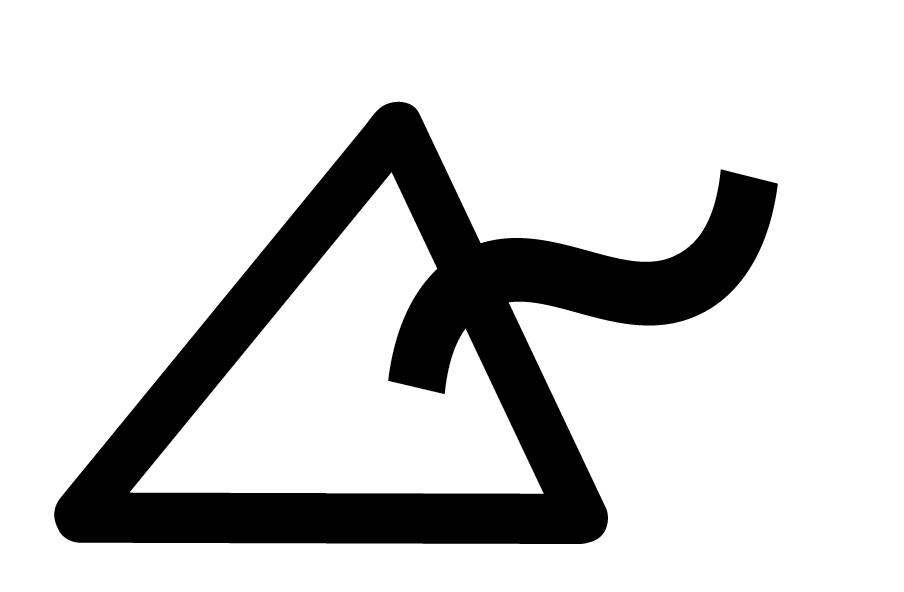

Gluon Builder Documentation
===========================

Welcome to the Gluon Builder Documentation!

|
|

.. include:: ../README.rst

Contents
--------

In the following the builder is documented in order how a normal compiling procedure is processed.

.. toctree::
   :maxdepth: 2

   builder
   preparation
   tools
   finishing

.. rubric:: Further stuff:

* :ref:`genindex`
* :ref:`modindex`
* :ref:`search`
